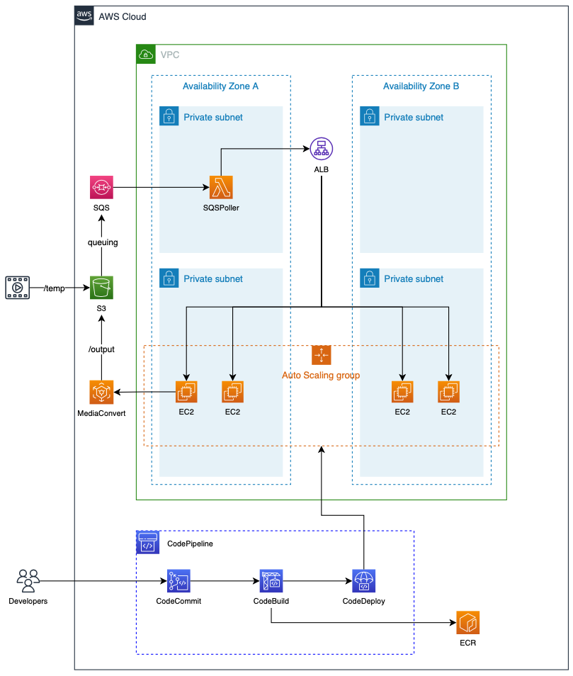
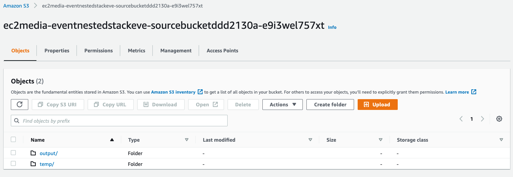

## MediaConvert with EC2
aws-ec2-mediaconvert
This example shows how to set up EC2 instance to create mediaconvert job and CI/CD Pipeline.




## Prerequisites
- Make sure you have [AWS CLI](https://docs.aws.amazon.com/cli/latest/userguide/install-cliv2.html) installed and configured with an aws account you want to use.
- Ensure you have [nodejs](https://nodejs.org) installed.
- Ensure you have [direnv](https://direnv.net) installed.
- Ensure you have [AWS MediaConvert](https://docs.aws.amazon.com/mediaconvert/latest/ug/getting-started.html) set up.

### install cdk
```shell
npm install
```

### create virtualenv
```shell
python3 -m venv .venv
source .venv/bin/activate
```

### install requirements
```shell
pip install -r requirements.txt
```

### setting .envrc for direnv
```shell
export AWS_PROFILE=<the configuration profile for aws-cli>
export ENDPOINT_URL=<account-specific endpoint for mediaconvert>
```

To get endpoint url for mediaconvert, run the given python script (utils/emc_endpoint.py)

```shell
$ source .venv/bin/activate  # You need to activate virtualenv first, skip this if you did.
$ python utils/emc_endpoint.py
```

### bootstrapping cdk
```shell
npx cdk bootstrap --profile <the configuration profile for aws-cli>
```

### deploy 
```shell
npx cdk deploy EC2Media
```

### Set up CodeCommit
If you run "npx cdk deploy EC2Media", then you will have codecommit repository named "ec2media",
You have to push flask source code to the codecommit repository. The flask source code is in ec2media directory.
To push the source code to codecommit, you need to set up codecommit to connect it.

Refer to the guideline below
- [Setup SSH connections to AWS CodeCommit](./ec2media/README.md)

After you set up codecommit, then run this command.
You can find <codecommit url> in AWS console for CodeCommit.
In seoul region, this would be git-codecommit.ap-northeast-2.amazonaws.com/v1/repos/ec2media


```shell
$ cd ec2media
$ git init
$ git remote add origin ssh://<codecommit url>
$ git add .
$ git commit -m "initial commit"
$ git push --set-upstream origin master
```

### Check CI/CD Pipeline
After you set up codecommit and push ec2media source code, go to CodePipeline AWS Console.
You will see a pipeline is in progress


### Test MediaConvert
Open S3 AWS Console, there is S3 bucket which starts with "ec2media-eventnestedstackeve"
Create temp and output folder



Upload sample media file to temp folder, output file will be placed to output folder.


## Security

See [CONTRIBUTING](CONTRIBUTING.md#security-issue-notifications) for more information.

## License

This library is licensed under the MIT-0 License. See the LICENSE file.

