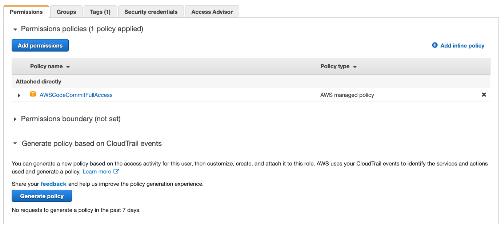
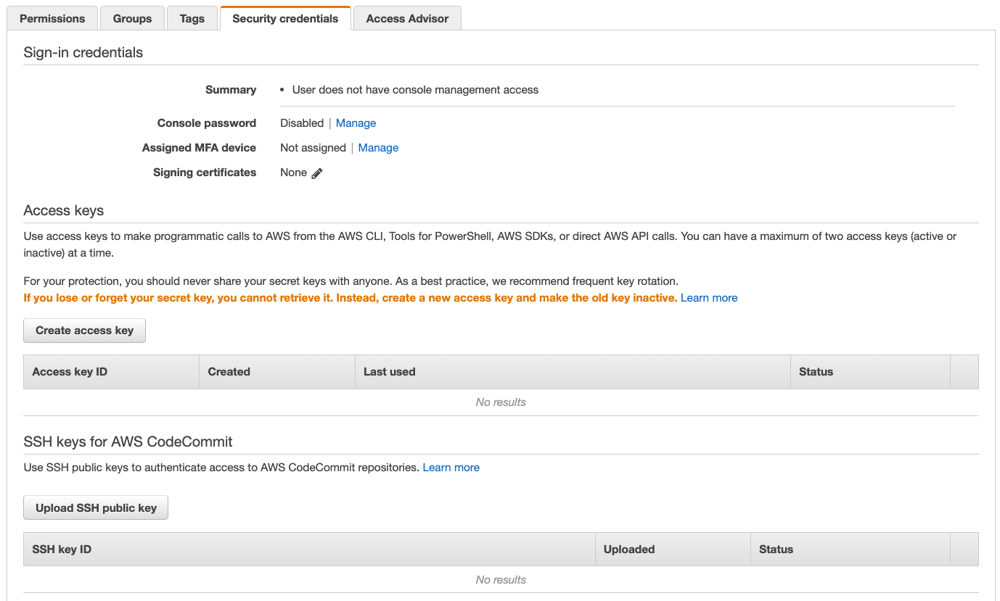
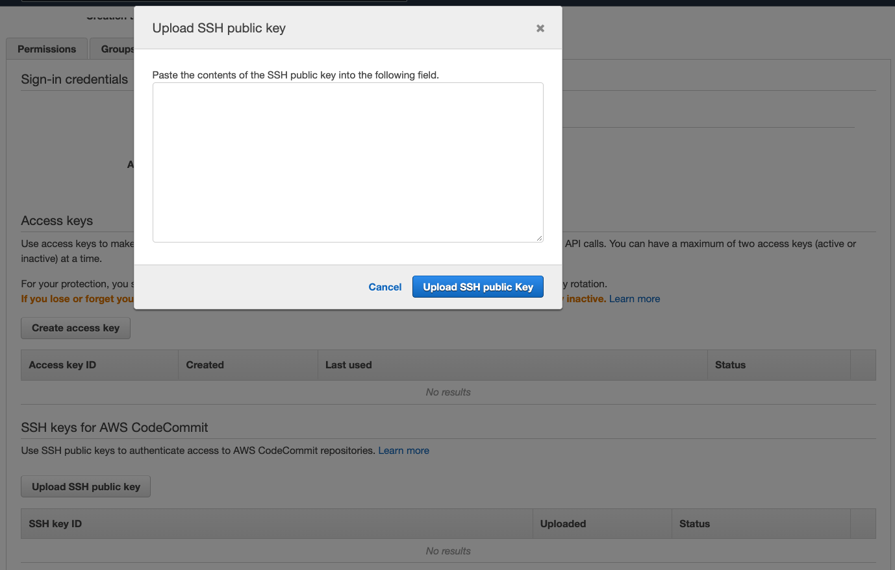
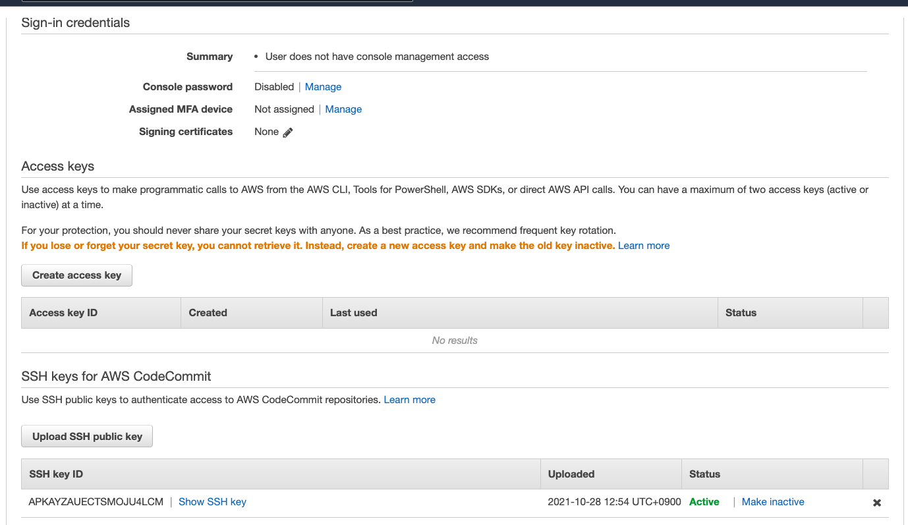

# Setup steps for SSH connections to AWS CodeCommit repositories

## Step 1: Setup IAM user
If your user account has not proper permission for CodeCommit, attach AWSCodeCommitFullAccess permission to the user account. 
Open AWS Console and go to IAM, then attach the permission



## Step 2: Check Existing SSH key
On your PC, open terminal and run following command to see if there is existing SSH key.

```shell
$ cd ~
$ ls -al ~/.ssh
```

If there is id_rsa.pub then skip Step 3 and go to Step 4.

## Step 3: Generate new SSH Key
Create new SSH key if there is not existing key

```shell
$ ssh-keygen
```

You can find the generated SSH private and public keys in ~/.ssh folder.

## Step 4: Add SSH Public Key to AWS IAM User
On your PC, open terminal and copy the output of "cat id_rsa.pub". This is public key.

```shell
$ cd ~/.ssh
$ cat id_rsa.pub
```

Open AWS Console and go to IAM, go to Security credentials.
Find Upload SSH public key button.



then paste the copied public key to the popup input window.



then you should see SSH Key ID, copy it.



## Step 5: Add SSH Key ID to SSH Config file
On your PC, open terminal and open SSH Config file with preferred editor.
if there is no config file, then create it.

```shell
$ cd ~/.ssh
$ vi config  # this is just example, you can use any editor.
```

Then add like below, just copy and paste, and change SSH Key ID with yours
```shell
Host git-codecommit.*.amazonaws.com
  User APKAYZAUECTSMOJU4LCM
  IdentityFile ~/.ssh/id_rsa
```
